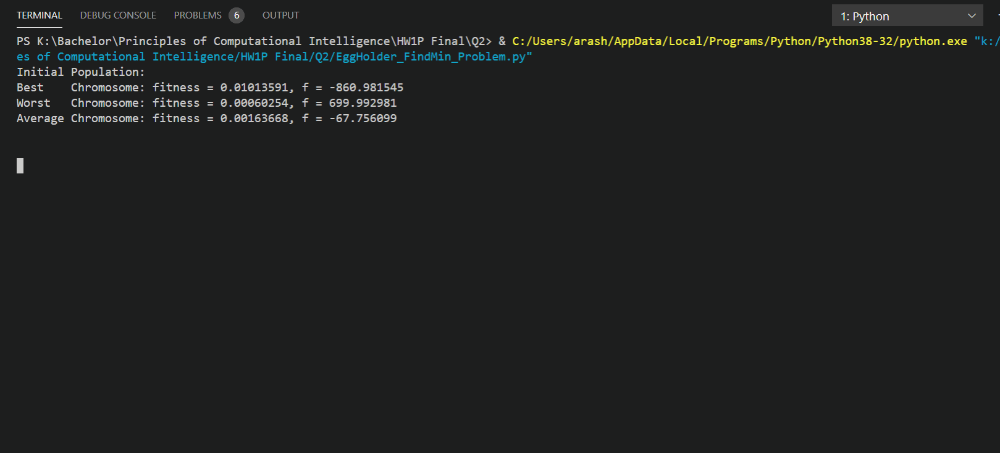

# Computational Intelligence Programming Task
Solving NP-Complete problems using Genetic Algorithms and Evolution Strategy for my Computational Intelligence course. In the first problem, I have solved the Steiner Tree Problem using Genetic Algorithms. The second problem is an optimization problem, I have implemented an ES algorithm to find the global minimum of the Eggholder function. For the final problem, I have implemented a GA to find an answer for a Constraint Satisfaction Problem (CSP).

This is how the ES that I have implemented approximates the global minimum of the Eggholder function (actual global minumum: f(512, 404.2319) = -959.6407)
  

